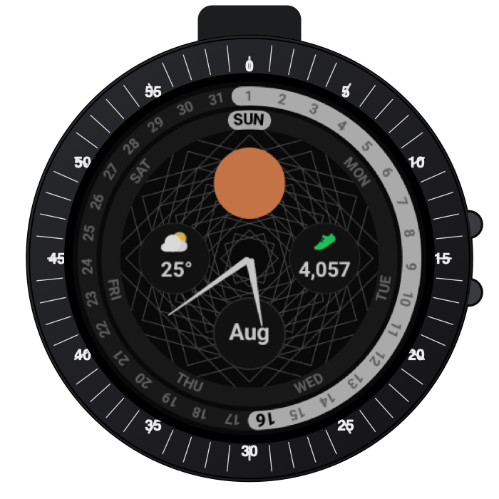

# Concentric

A Wear OS watch face built with the [Watch Face Format](https://developer.android.com/training/wearables/wff) — pure declarative XML, no app code.



## Design

- Two concentric progress rings around the dial: an inner **week** ring (curved weekday labels, starting Sunday) and an outer **month** ring (curved day-of-month numbers, spaced by the actual number of days in the current month). Each ring fills from the start of the week/month up to today, so your position in both is visible at a glance.
- A 12 o'clock sun by day and moon by night.
- Two complication slots (3 and 9 o'clock) plus a static current-month label (6 o'clock).
- Classic tapered analog hour/minute hands, no second hand.
- A subtle woven geometric pattern in the background.

## Requirements

Watch Face Format requires **Wear OS 4+** (API 33+). Building and installing requires no Kotlin/Java toolchain beyond the Android Gradle plugin — there's no app code, just XML and image resources.

## Build & install

```
./gradlew assembleDebug
adb install -r app/build/outputs/apk/debug/app-debug.apk
```

Then select "Concentric" from the watch face picker on your device, and assign data sources to the two complication slots via the picker's edit flow.
